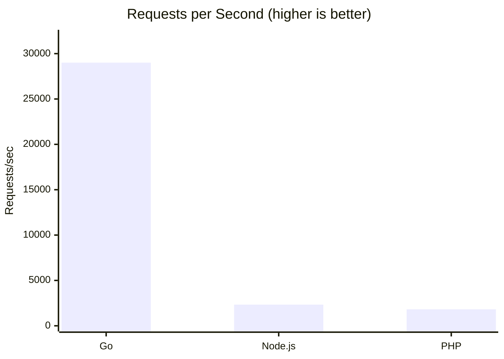
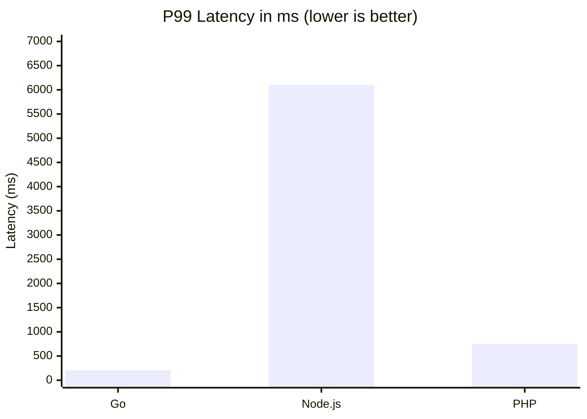
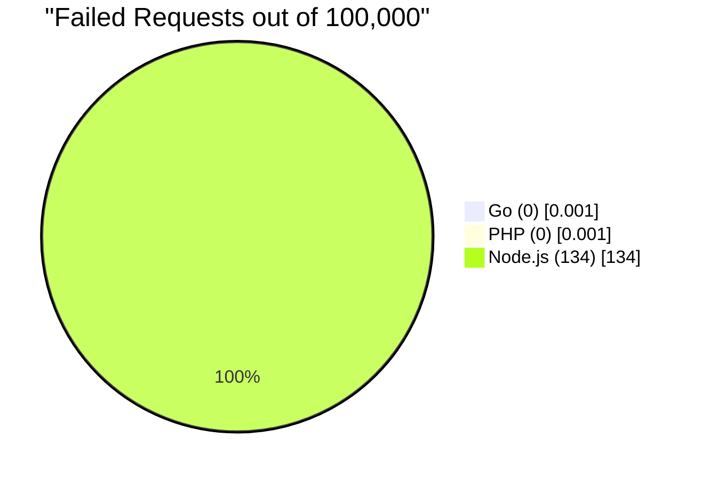
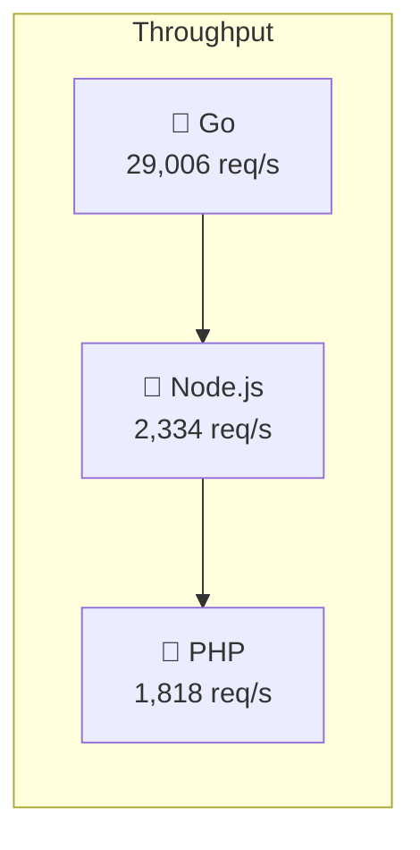

# HTTP Server Benchmark Results

A comparative performance analysis of Go, Node.js, and PHP HTTP servers handling concurrent workloads.

## Test Environment

- **OS:** Linux (WSL2) - Ubuntu on Windows
- **Kernel:** 6.6.87.2-microsoft-standard-WSL2
- **Go Version:** 1.22.2
- **Node.js Version:** (system default)
- **PHP Version:** 8.4.12
- **Benchmark Tool:** [hey](https://github.com/rakyll/hey) (Go-based HTTP load generator)

## Test Configuration

- **Total Requests:** 100,000
- **Concurrency:** 1,000 simultaneous connections
- **Endpoint:** `GET /square`

## Server Implementation

Each server implements the same logic:

1. Create a job queue with 101 items (numbers 0-100)
2. Spawn 10 workers to process jobs concurrently
3. Each worker calculates the square of its assigned number
4. Collect all results
5. Return a random result as JSON

This pattern simulates a realistic workload with concurrent processing, channel/queue communication, and result aggregation.

---

## Visual Comparison

### Throughput (Requests/Second)



### P99 Latency



### Reliability



### Performance Hierarchy



---

## Results Summary

| Metric | Go | Node.js | PHP |
|--------|-----|---------|-----|
| **Requests/sec** | 29,006 | 2,334 | 1,818 |
| **Total Time** | 3.4s | 42.8s | 55.0s |
| **Avg Latency** | 23ms | 152ms | 548ms |
| **P99 Latency** | 207ms | 6,102ms | 753ms |
| **Max Latency** | 435ms | 19,662ms | 958ms |
| **Failed Requests** | 0 | 134 | 0 |

### Performance Relative to Go

| Language | Throughput | Latency (P99) |
|----------|------------|---------------|
| Go | 1x (baseline) | 1x (baseline) |
| Node.js | 12.4x slower | 29.5x slower |
| PHP | 16.0x slower | 3.6x slower |

---

## Detailed Results

### Go (go1.22.2)

```
Summary:
  Total:        3.4 secs
  Slowest:      0.4350 secs
  Fastest:      0.0001 secs
  Average:      0.0232 secs
  Requests/sec: 29,006

Latency distribution:
  10% in 0.0033 secs
  25% in 0.0079 secs
  50% in 0.0176 secs
  75% in 0.0379 secs
  90% in 0.0835 secs
  95% in 0.1160 secs
  99% in 0.2071 secs

Status code distribution:
  [200] 100,000 responses (0 failures)
```

### Node.js

```
Summary:
  Total:        42.8 secs
  Slowest:      19.6622 secs
  Fastest:      0.0001 secs
  Average:      0.1523 secs
  Requests/sec: 2,334

Latency distribution:
  10% in 0.0014 secs
  25% in 0.0027 secs
  50% in 0.0063 secs
  75% in 0.0163 secs
  90% in 0.1247 secs
  95% in 0.2304 secs
  99% in 6.1023 secs

Status code distribution:
  [200] 99,866 responses

Error distribution:
  [134] Failed requests (timeouts and connection resets)
```

### PHP (8.4.12)

```
Summary:
  Total:        54.9941 secs
  Slowest:      0.9575 secs
  Fastest:      0.1808 secs
  Average:      0.5475 secs
  Requests/sec: 1,818

Latency distribution:
  10% in 0.4772 secs
  25% in 0.4943 secs
  50% in 0.5258 secs
  75% in 0.5776 secs
  90% in 0.6723 secs
  95% in 0.7016 secs
  99% in 0.7526 secs

Status code distribution:
  [200] 100,000 responses (0 failures)
```

---

## Analysis

### Go

Go demonstrated exceptional performance characteristics:

- **Highest throughput** at 29,006 requests/second
- **Lowest latency** with P99 at 207ms
- **Zero failures** under heavy load
- **Consistent performance** with tight latency distribution

Go's goroutine-based concurrency model allows true parallel execution across multiple CPU cores. The M:N scheduling (many goroutines to few OS threads) provides lightweight concurrency with minimal overhead.

### Node.js

Node.js showed limitations under high concurrency:

- **Moderate throughput** at 2,334 requests/second
- **High tail latency** with P99 at 6.1 seconds
- **134 failed requests** due to timeouts and connection resets
- **Inconsistent performance** with some requests taking 19+ seconds

Node's single-threaded event loop becomes a bottleneck when handling CPU-bound concurrent work. While excellent for I/O-bound operations, it struggles with parallel computation.

### PHP

PHP (built-in server) demonstrated stable but slow performance:

- **Lowest throughput** at 1,818 requests/second
- **Consistent latency** with P99 at 753ms
- **Zero failures** - gracefully handled all requests
- **Predictable performance** despite being slower

PHP's built-in development server is single-process and handles requests sequentially. While slow, it queued requests gracefully without failures. Production PHP setups (PHP-FPM with multiple workers) would show improved throughput.

---

## Key Takeaways

1. **Go excels at high-concurrency workloads** - 12-16x faster than Node.js and PHP for this test case.

2. **Node.js struggles under pressure** - While fast at lower concurrency, it fails and times out under heavy parallel load.

3. **PHP is slow but reliable** - The built-in server handled all requests without failure, just slowly.

4. **Goroutines are lightweight** - Go spawned 10,000+ goroutines simultaneously with minimal overhead.

5. **Choose the right tool for the job:**
   - **Go** - High-throughput APIs, microservices, infrastructure
   - **Node.js** - I/O-bound applications, real-time features, full-stack JavaScript
   - **PHP** - Rapid development, content management, traditional web applications

---

## Reproducing These Results

### Start Go Server
```bash
cd benchmark
go run server.go
```

### Start Node.js Server
```bash
cd benchmark-node
node server.js
```

### Start PHP Server
```bash
cd benchmark-php
php -S localhost:8080 server.php
```

### Run Benchmark
```bash
# Install hey
go install github.com/rakyll/hey@latest

# Run benchmark (ensure only one server is running on port 8080)
~/go/bin/hey -n 100000 -c 1000 http://localhost:8080/square
```

---

## Notes

- PHP was tested with the built-in development server. Production PHP-FPM with multiple workers would perform better.
- Node.js could potentially improve with clustering or worker threads, though this adds complexity.
- WSL2 networking adds some overhead; native Linux would likely show even higher numbers for all languages.
- These benchmarks test a specific concurrent computation pattern. Different workloads (I/O-bound, database-heavy) may show different relative performance.

---

*Benchmark conducted January 2026*
