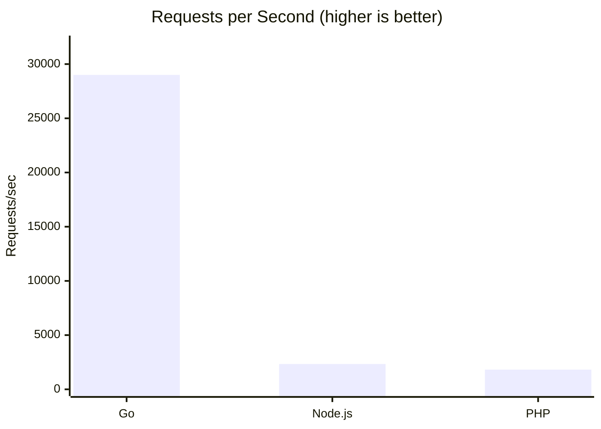

# Go Learning Repository

A hands-on Go learning path from fundamentals to high-performance gRPC services, with real-world benchmarks comparing Go, Node.js, and PHP.

## Overview

This repository contains:

- **15 progressive lessons** covering Go from basics to advanced concurrency
- **Benchmark suite** comparing Go, Node.js, and PHP HTTP server performance
- **Practical examples** you can run and modify

## Quick Start

```bash
# Clone the repo
git clone https://github.com/yourusername/go-example.git
cd go-example

# Run any lesson
cd 01-hello-world
go run main.go
```

## Learning Path

### Phase 1: Fundamentals (Lessons 01-06)

| Lesson | Topic | Key Concepts |
|--------|-------|--------------|
| [01-hello-world](./01-hello-world) | Hello World | Package structure, `main()`, `fmt.Println` |
| [02-variables-and-types](./02-variables-and-types) | Variables & Types | Declaration, type inference, zero values, `iota` |
| [03-control-flow](./03-control-flow) | Control Flow | `if`, `for`, `switch`, `defer`, `range` |
| [04-functions](./04-functions) | Functions | Multiple returns, closures, variadic, `init()` |
| [05-structs-and-interfaces](./05-structs-and-interfaces) | Structs & Interfaces | Methods, implicit interfaces, embedding |
| [06-error-handling](./06-error-handling) | Error Handling | `error` type, wrapping, custom errors, `panic/recover` |

### Phase 2: Data Structures & Memory (Lessons 07-09)

| Lesson | Topic | Key Concepts |
|--------|-------|--------------|
| [07-slices-and-maps](./07-slices-and-maps) | Slices & Maps | Arrays vs slices, `append`, `range`, map operations |
| [08-pointers](./08-pointers) | Pointers | `&`, `*`, pointer receivers, no pointer arithmetic |
| [09-packages-and-modules](./09-packages-and-modules) | Packages & Modules | `go.mod`, visibility, `init()`, project structure |

### Phase 3: Concurrency (Lessons 10-13)

| Lesson | Topic | Key Concepts |
|--------|-------|--------------|
| [10-concurrency-basics](./10-concurrency-basics) | Concurrency Basics | Goroutines, `sync.WaitGroup`, closure gotchas |
| [11-channels-and-select](./11-channels-and-select) | Channels & Select | Buffered/unbuffered, `select`, worker pools, fan-out/fan-in |
| [12-sync-patterns](./12-sync-patterns) | Sync Patterns | `Mutex`, `RWMutex`, `atomic`, `sync.Once`, `sync.Pool` |
| [13-context](./13-context) | Context | Cancellation, timeouts, deadlines, request-scoped values |

### Phase 4: Production (Lessons 14-15)

| Lesson | Topic | Key Concepts |
|--------|-------|--------------|
| [14-http-server](./14-http-server) | HTTP Server | `net/http`, handlers, middleware, graceful shutdown |
| [15-grpc](./15-grpc) | gRPC | Protocol buffers, streaming, interceptors, performance tips |

## Practical Examples

Real-world integrations demonstrating Go with external services.

### OpenAI Integration

| Example | Description | Features |
|---------|-------------|----------|
| [openai-stream-chat](./openai-stream-chat) | Interactive chat with GPT | Streaming responses, conversation history |
| [openai-stream-chat-with-tools](./openai-stream-chat-with-tools) | Chat with function calling | Tool definitions, math operations, streaming |

```bash
export OPENAI_API_KEY=your-key
cd openai-stream-chat
go run main.go
```

### Database CLIs

Three identical CLI apps demonstrating Go with different databases. Each app:
- Stores input text as key, reversed string as value
- Shows a table after each operation
- Deletes entry if key already exists
- Cleans up all entries on Ctrl+C

| Example | Database | Driver |
|---------|----------|--------|
| [redis-reverse-cli](./redis-reverse-cli) | Redis | `go-redis/v9` |
| [postgres-reverse-cli](./postgres-reverse-cli) | PostgreSQL | `pgx/v5` |
| [mongo-reverse-cli](./mongo-reverse-cli) | MongoDB | `mongo-driver` |

```bash
# Start database (pick one)
docker run -d -p 6379:6379 redis
docker run -d -p 5432:5432 -e POSTGRES_PASSWORD=postgres postgres
docker run -d -p 27017:27017 mongo

# Run corresponding CLI
cd redis-reverse-cli && go run main.go
cd postgres-reverse-cli && go run main.go
cd mongo-reverse-cli && go run main.go
```

---

## Benchmarks

Real-world performance comparison between Go, Node.js, and PHP.

See full results: [BENCHMARK_RESULTS.md](./BENCHMARK_RESULTS.md)

### Quick Results

| Metric | Go | Node.js | PHP |
|--------|-----|---------|-----|
| **Requests/sec** | 29,006 | 2,334 | 1,818 |
| **vs Go** | 1x | 12x slower | 16x slower |
| **Failed Requests** | 0 | 134 | 0 |



### Running Benchmarks

```bash
# Install benchmark tool
go install github.com/rakyll/hey@latest

# Go server
cd benchmark && go run server.go
# In another terminal:
~/go/bin/hey -n 100000 -c 1000 http://localhost:8080/square

# Node.js server
cd benchmark-node && node server.js
# In another terminal:
~/go/bin/hey -n 100000 -c 1000 http://localhost:8080/square

# PHP server
cd benchmark-php && php -S localhost:8080 server.php
# In another terminal:
~/go/bin/hey -n 100000 -c 1000 http://localhost:8080/square
```

## Repository Structure

```
go-example/
├── README.md
├── BENCHMARK_RESULTS.md
├── go-learning-roadmap.md
│
│── Lessons ──────────────────────────
├── 01-hello-world/
├── 02-variables-and-types/
├── 03-control-flow/
├── 04-functions/
├── 05-structs-and-interfaces/
├── 06-error-handling/
├── 07-slices-and-maps/
├── 08-pointers/
├── 09-packages-and-modules/
├── 10-concurrency-basics/
├── 11-channels-and-select/
├── 12-sync-patterns/
├── 13-context/
├── 14-http-server/
├── 15-grpc/
│
│── Practical Examples ───────────────
├── openai-stream-chat/           # OpenAI chat with streaming
├── openai-stream-chat-with-tools/ # OpenAI chat with function calling
├── redis-reverse-cli/            # Redis CLI example
├── postgres-reverse-cli/         # PostgreSQL CLI example
├── mongo-reverse-cli/            # MongoDB CLI example
│
│── Benchmarks ───────────────────────
├── benchmark/              # Go server (with goroutines)
├── benchmark-optimized/    # Go server (pre-calculated)
├── benchmark-node/         # Node.js server
└── benchmark-php/          # PHP server
```

## Prerequisites

- **Go 1.22+** - [Installation guide](https://go.dev/doc/install)
- **Docker** (optional, for database examples and benchmarks)
- **Node.js** (optional, for benchmarks)
- **PHP 8.1+** (optional, for benchmarks)
- **OpenAI API Key** (optional, for OpenAI examples)

## Resources

| Topic | Resource |
|-------|----------|
| Go basics | [Go by Example](https://gobyexample.com) |
| Official tour | [tour.golang.org](https://go.dev/tour/) |
| Concurrency | "Concurrency in Go" by Katherine Cox-Buday |
| gRPC | [grpc.io Go docs](https://grpc.io/docs/languages/go/) |
| Patterns | [Go Patterns](https://github.com/tmrts/go-patterns) |

## License

MIT

---

*Learning Go for high-performance applications? Star this repo and follow along!*
